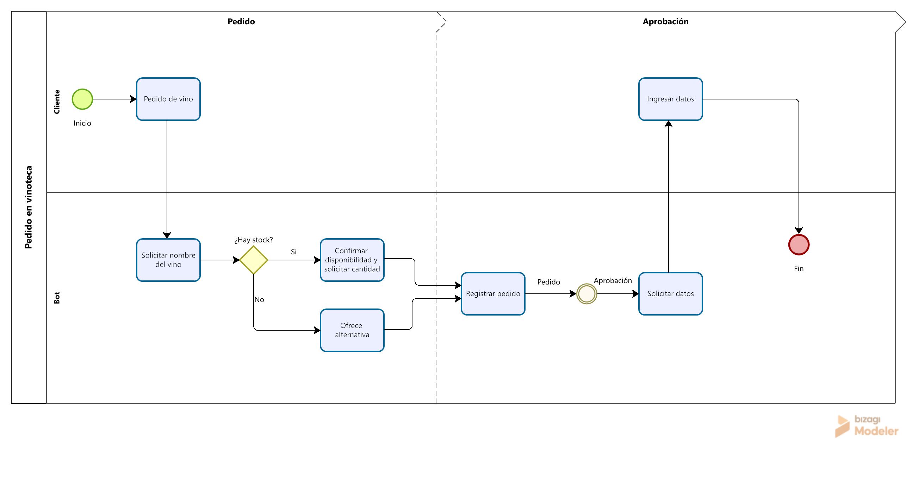

# VinosBot 🍷

## 📌 Descripción
VinosBot es un proyecto académico desarrollado en Java que simula un chatbot de Telegram para gestionar pedidos de vinos.  
El bot se conecta a un archivo Excel que funciona como base de datos de productos, permitiendo consultar stock, buscar por nombre o bodega, y registrar pedidos de clientes.

## 🧩 Funcionalidades principales
- Buscar vinos por **nombre** o **bodega**.
- Listar vinos **disponibles** y **agotados**.
- Solicitar cantidad de botellas y validar stock.
- Registrar pedidos con datos del cliente (nombre y teléfono).
- Descontar stock automáticamente al confirmar el pedido.

## 🗂️ Clases principales
- **Vino** → representa un vino con sus atributos (id, nombre, bodega, precio, stock).
- **GestorVinos** → carga los vinos desde Excel y permite búsquedas.
- **Pedido** → representa un pedido con vino, cantidad y datos del cliente.
- **GestorPedidos** → administra la lista de pedidos y actualiza stock.
- **VinosBot** → implementación del bot de Telegram con lógica de estados.

## ⚙️ Requisitos
- Java 8 o superior
- NetBeans IDE (opcional)
- Librería [Apache POI](https://poi.apache.org/) para leer Excel
- Token de Telegram Bot válido

## 🚀 Ejecución
1. Clonar el repositorio:
   ```bash
   git clone https://github.com/facundopeli/vinos-bot.git

## 📊 Diagrama BPMN

